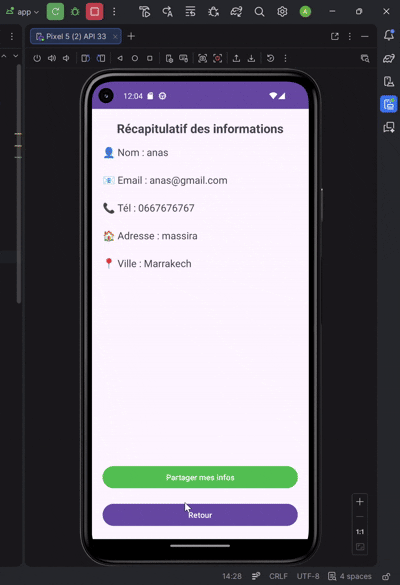

# TP3 : Développement d'une Application Android de Formulaire


## 📝 Présentation
Ce projet a été réalisé dans le cadre du module de développement mobile. L'objectif est de concevoir une application Android native permettant la saisie d'informations utilisateur, leur validation, et leur transmission vers une activité de récapitulatif.

## 🚀 Fonctionnalités Clés
* **Interface Utilisateur (UI)** : Utilisation de `ScrollView` et `LinearLayout` pour un formulaire ergonomique et adaptatif.
* **Validation des Données** :
    * Vérification des champs obligatoires (Nom et Email).
    * Validation syntaxique de l'adresse email via `Patterns.EMAIL_ADDRESS`.
* **Communication Inter-Activités** : Transmission des données via des **Intents Explicites** et passage de paramètres par *Extras*.
* **Cycle de Vie** : Réinitialisation automatique des champs de saisie lors du retour à l'écran principal via la méthode `onResume`.
* **Partage (Bonus)** : Intégration d'un **Intent Implicite** (`ACTION_SEND`) permettant de partager le récapitulatif via des applications tierces (WhatsApp, Gmail, SMS, etc.).

## 🛠️ Stack Technique
* **Langage** : Java
* **IDE** : Android Studio (Ladybug / Koala)
* **Concepts Android** : Intents, Toast, Lifecycle, XML Layouts, Event Handling.

## 📸 Démonstration de l'Application
<div align="center">
  
  <p><i>Aperçu du fonctionnement du formulaire et du partage</i></p>
</div>

## 📂 Structure du Projet
```text
app/src/main/
├── java/com/exemple/tp3/
│   ├── MainActivity.java      # Gestion du formulaire et validations
│   └── Screen2Activity.java   # Réception, affichage et partage des données
├── res/layout/
│   ├── activity_main.xml      # Layout du formulaire (Saisie)
│   └── activity_screen2.xml   # Layout du récapitulatif (Affichage)
└── AndroidManifest.xml        # Déclaration et configuration des activités
⚙️ Installation & Test
Clonez le dépôt :

git clone [https://github.com/4n4s2l2rn/Lab3.git](https://github.com/4n4s2l2rn/Lab3.git)
Ouvrez le projet avec Android Studio.

Synchronisez le projet avec les fichiers Gradle.

Lancez l'application sur un émulateur ou un smartphone physique.

🎓 Auteur
Aourik Anas Étudiant en 4ème année Génie Cyber Defense et systemes de telecom embarque - ENSA Marrakech
